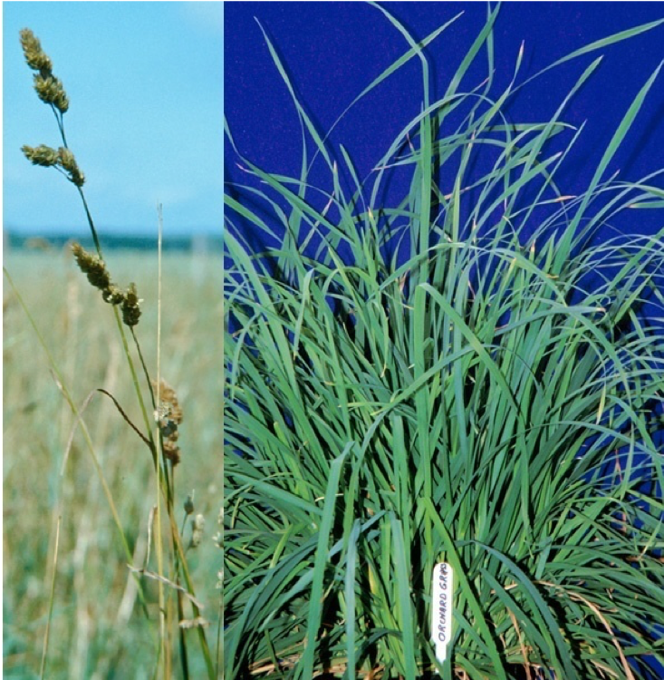
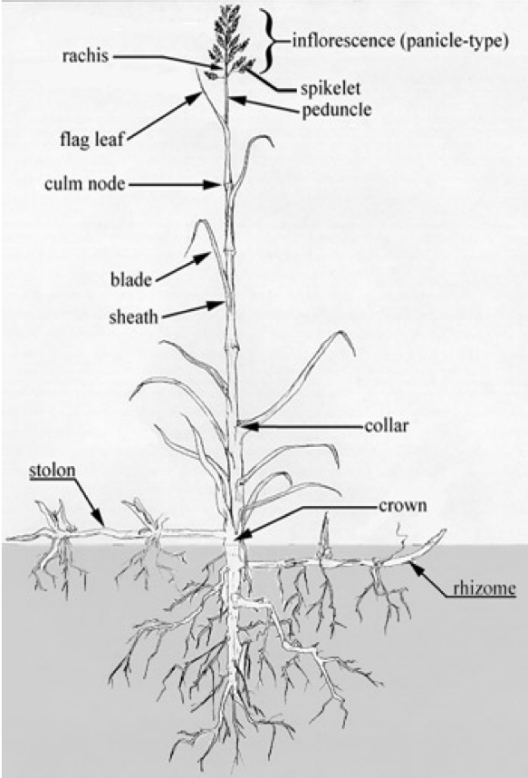

# Classification {#classification}

## 식물학적 분류
```{r echo=FALSE, out.width=400}
knitr::include_graphics("figures/kingdom.png")
```

## 형태에 의한 분류
- 벼(화본)과 사료작물: orchardgrass, timothy, tall fescue, 보리, 옥수수, 밀, 벼, 수수, 피, 조
- 콩(두)과 사료작물: clover류, birdsfoot trefoil, vetch류, 콩, 완두
- 국과 사료작물: 해바라기, 돼지감자 등  
- 십자화과 사료작물: 일반근채류(순무, 당근, 루타바카), 유채, 양배추
- 기타: 고구마 등

### 벼과 사료작물
#### 벼과 사료작물의 특성
- 사료작물의 약 75% 점유
- 전세계적으로 600속, 약 5,000종 분포
- *Poaceae*과(벼과) 작물(*Gramineae*)
- 초본류 식물, 종자생산, 목질조직 발달미약
- 외떡잎 식물
- 다양한 초종의 분포 
- 수량이 많고 방목이나 채초용으로 적합
- 재생력이 강하다
- 기호성이 좋고 영양가가 높다

```{r echo=FALSE, out.width=400}

```

#### 벼과 목초의 일반적인 특징
- 수염모양의 root system 
- 줄기(stems)는 속이 비어있다
- 명확한 마디(node) 보유
- 잎(leaves)은 나란히맥이며, 마디마다 1잎씩 어긋난 형태
- 잎은 잎집(sheath), 잎몸(blade), 잎혀 (ligule), 잎귀(auricle)로 구성
- 꽃차례는 수상, 원추, 총상 꽃차례로 구성
- 꽃(flowers)은 3(1~3)개의 수술(雄蘂;stamen), 2개의 인피(鱗被;lodicules), 1개의 암술(雌蘂;pistil)로 되어 있고 바깥쪽은 내영(內穎; palea)과 외영(外穎;lemma)으로 되어 있다
- 일반적으로 외영은 1개의 까끄라기(awn)를 가지고 비스듬히 기울어져 있다
- 열매(fruit)는 씨방벽(子房壁;ovary wall)에 융합되어 있는 하나의 종자를 가지고 있다
- 종자, 영양체(분얼,Tillering), 포복경(stolon), 지하경 (rhizome)에 의한 번식

```{r echo=FALSE, out.width=300}

```


## 기상연한에 의한 분류
## 생존연한에 의한 분류
## 이용형태에 의한 분류

