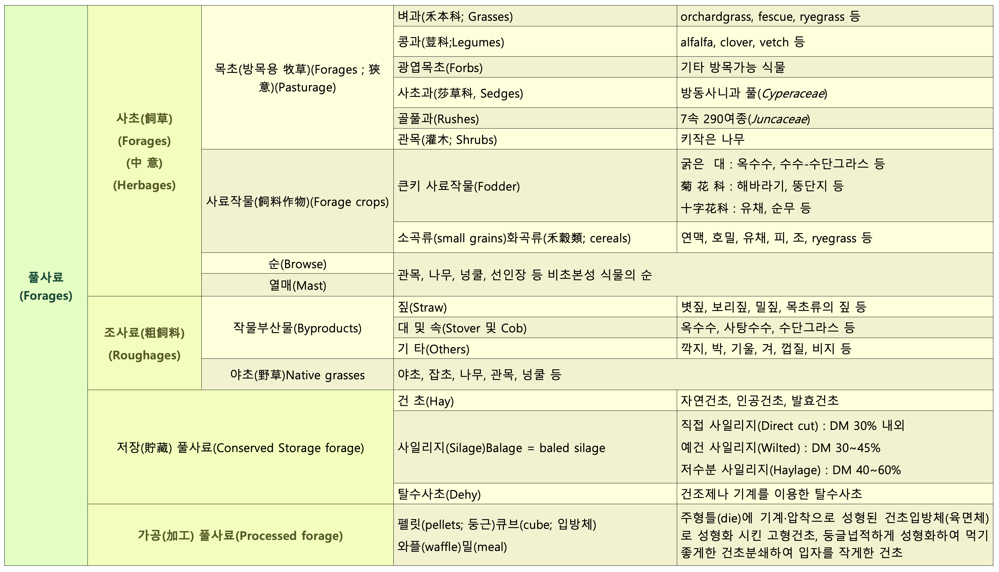
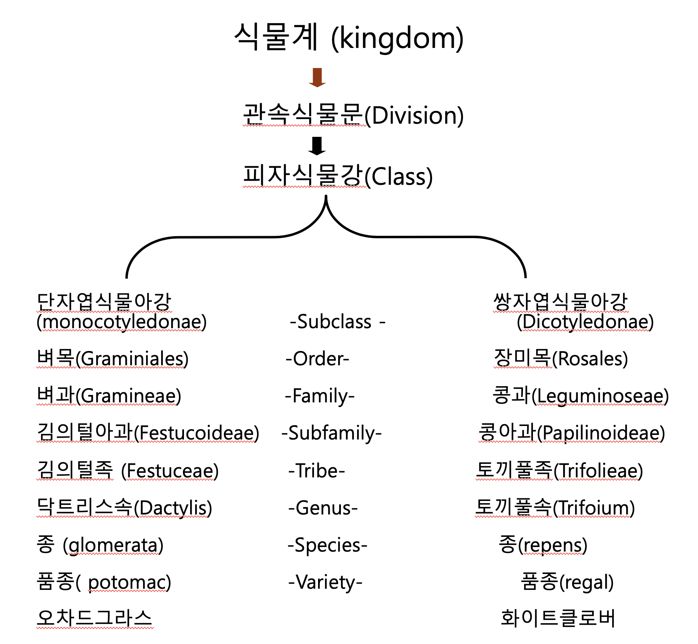
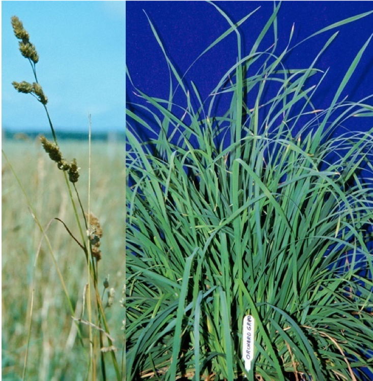
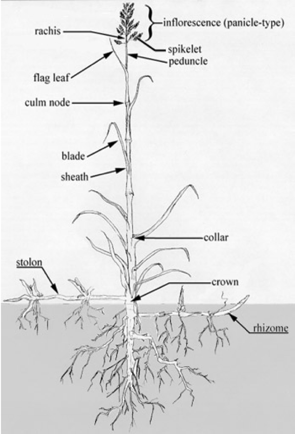

# Welcome {-}

초지 및 사료작물학 강의자료입니다.

```{r include=FALSE}
# automatically create a bib database for R packages
knitr::write_bib(c(
  .packages(), 'bookdown', 'knitr', 'rmarkdown'
), 'packages.bib')
```

<!--chapter:end:index.Rmd-->

# Introduction {#intro}  

사료는 가축이나 가금 따위에게 주는 먹이를 말한다. 가축이 생명유지 및 생산활동에 필요로 하는 각종 영양소를 함유하고 있는 유기 또는 무기의 물질로 일반적으로 조사료, 농후사료, 특수사료로 나눈다(축산학적 의미). 「축산법」에 따른 가축이나 그 밖에 농림축산식품부장관이 정하여 고시하는 동물·어류 등에 영양이 되거나 그 건강유지 또는 성장에 필요한 것으로서 단미사료·배합사료 및 보조사료를 말한다. 다만, 동물용의약으로서 섭취하는 것을 제외한다(사료관리법).

## 풀사료

- 조사료(粗飼料, bulky feed, roughage)는 **지방, 단백질, 전분 등의 함량이 적고 섬유질이 18% 이상 되는 사료, 청초, 건초 따위로** 반대는 농후사료(濃厚飼料, concentrates)이다.
- 조사료(forage, roughage)는 "가축의 사료 중 일반적으로 부피에 비하여 가소화영양소 함량이 적고 섬유질이 많은 사료의 총칭, 이에는 각종 짚류(straw), 건초류(hay), 생초류와 청예작물 그리고 사일리지와 근채류 등이 포함된다" (한국영양사료학회, 1995)
- 조사료는 짚(straws), 대(stover), 깍지 및 식물부산물 등으로 지방, 단백질, 전분 등의 함량이 적고 섬유질이 18%이상인 풀사료
- **풀사료는 조사료, 양질조사료, 기타 식물성 잎과 줄기 등을 모두 포함하는 사료**

## 풀사료의 분류

```{r echo=FALSE}

```

## 풀사료의 평가
### 풀사료를 평가하는 이유
- 풀사료를 가장 효과적으로 이용하고 생산성을 최대로 높이기 위하여
- 영양가의 차이가 매우 심하기 때문(단백질 함량 : 알팔파; 10∼25%, 벼과  건초; 4∼20%)
- 가축의 영양소 요구량은 천차만별(축종, 시기, 상태 등). 즉, 생산성이 높거나 영양소 요구량이 많을때 가장 좋은 풀사료를, 요구량이 낮은 가축이나 시기에는 저질의 풀사료 급여하는 것이 경제적이기 때문
- 시장의 올바른 유통을 위하여(객관적인 유통가격 결정자료로 이용되어, 풀사료에 대한 정확한 지식이 없는 농가의 피해를 줄이기 위함)
- 올바른 사료배합(특정가축의 요구량에 맞는 사료를 배합할 때 어느 사료를 얼마만큼 넣는 것이 경제적인지를 판단하는 자료로 이용)
- 단위면적당 생산성을 높이기 위하여


### 평가방법
1. 관능검사(官能檢査, visual appraisal, Physical : 사람의 오감(五感)을 통하여 평가하는 방법), 
2. 화학적 분석(Chemical analysis)
3. 근적외선 분광측정기(NIRS; Near infrared reflectance spectroscopy)
4. *In vivo* 및 *in vitro*
5. 사양시험(digestion or feeding trial)

### 풀사료의 영양가치에 영향을 미치는 요인
- 초종과 품종(Plant species and variety)
- 숙기(Maturity)
- 잎의 비율(Leafiness)
- 수확(Harvest)
- 저장(Storage) 방법과 저장 기술
- 환경(Environment)

### 축우사료에서 풀사료의 중요성
#### 반추가축의 소화생리

**가. 반추위내의 미생물의 기능**  

- 섬유소의 분해  
- 아미노산의 합성  
- Vit. B, K의 합성  
- 미생물유체로서 영양소의 공급  

**나. 반추위의 소화율**  

**다. 반추위 내에서의 사료의 소화**  

- 휘발성지방산(VFA, volatile fatty acid))의 생성  
- 조사료 위주 : 반추위의 초산 증가(초산 : 에너지원, 유지방합성 원료)  
- 농후사료 위주 : 반추위의 프로피온산 증가(프로피온산 : 에너지원, 체지방합성 원료)  

#### 반추위의 정의와 발달
- 반추위: 반추동물의 제1위와 제2위(1위만을 의미하기도 함). 1위와 2위는 큰 구멍으로 연결되어 있고 내용물 이동이 자유로우며 소화기능상의 차이가 없음.
- 갓 태어났을 때 : 4위보다 작고 기능도 거의 없음. 미생물도 서식하지 않음
- 조사료 섭취 개시 후 : 급격히 발달이 촉진
- 생후 3개월 이후 제1위만의 무게가 체중의 20%, 소화기관 중에서 가장 큰 기관으로 성장
- 생후 6개월 이후 : 모든 위의 80% 이상 차지.  
- 조사료에 의한 물리적 자극.
    + 성장 초기에 조사료를 충분히 공급하여야 반추위가 충실하게 발달
    + 육성기 사육방법이 중요한 이유.
    
### 풀사료의 특성 및 중요성
1. 사료가치: TDN과 CP의 함량은 농후사료에 비해 상대적을 낮으나, 무기물(Ca, P, Cu 등) vitamin 등이 높고, 각종 영양소가 완벽하게 조화를 이루고 있어, 단일사료로 급여하여도 안전한 생산에 문제가 없다.

2. 정상적인 생리기능유지: 조사료부족시 소화기장해(제4위전위증, 제엽염, 과산증, 과비증후군) 유지율저하, 번식장해 발생

3. 자급조사료의 경우 경제성과 사료수급의 안정성 향상

4. **인간의 식량과 경합이 없다**


<!--chapter:end:01-intro.Rmd-->

# Classification {#classification}

## 식물학적 분류
```{r echo=FALSE, out.width=400}

```

## 형태에 의한 분류
- 벼(화본)과 사료작물: orchardgrass, timothy, tall fescue, 보리, 옥수수, 밀, 벼, 수수, 피, 조
- 콩(두)과 사료작물: clover류, birdsfoot trefoil, vetch류, 콩, 완두
- 국과 사료작물: 해바라기, 돼지감자 등  
- 십자화과 사료작물: 일반근채류(순무, 당근, 루타바카), 유채, 양배추
- 기타: 고구마 등

### 벼과 사료작물
#### 벼과 사료작물의 특성
- 사료작물의 약 75% 점유
- 전세계적으로 600속, 약 5,000종 분포
- *Poaceae*과(벼과) 작물(*Gramineae*)
- 초본류 식물, 종자생산, 목질조직 발달미약
- 외떡잎 식물
- 다양한 초종의 분포 
- 수량이 많고 방목이나 채초용으로 적합
- 재생력이 강하다
- 기호성이 좋고 영양가가 높다

```{r echo=FALSE, out.width=400}

```

#### 벼과 목초의 일반적인 특징
- 수염모양의 root system 
- 줄기(stems)는 속이 비어있다
- 명확한 마디(node) 보유
- 잎(leaves)은 나란히맥이며, 마디마다 1잎씩 어긋난 형태
- 잎은 잎집(sheath), 잎몸(blade), 잎혀 (ligule), 잎귀(auricle)로 구성
- 꽃차례는 수상, 원추, 총상 꽃차례로 구성
- 꽃(flowers)은 3(1~3)개의 수술(雄蘂;stamen), 2개의 인피(鱗被;lodicules), 1개의 암술(雌蘂;pistil)로 되어 있고 바깥쪽은 내영(內穎; palea)과 외영(外穎;lemma)으로 되어 있다
- 일반적으로 외영은 1개의 까끄라기(awn)를 가지고 비스듬히 기울어져 있다
- 열매(fruit)는 씨방벽(子房壁;ovary wall)에 융합되어 있는 하나의 종자를 가지고 있다
- 종자, 영양체(분얼,Tillering), 포복경(stolon), 지하경 (rhizome)에 의한 번식

```{r echo=FALSE, out.width=300}

```


## 기상연한에 의한 분류
## 생존연한에 의한 분류
## 이용형태에 의한 분류


<!--chapter:end:02-classification.Rmd-->

# Grass and legume {#legumeandgrass} 
  
## 벼과 사료작물

### 가축사료로서의 중요성
- 기호성이 우수하고 영양가가 높다
- 방목지나 채초지의 사초로써 그 가치가 높다
- 방목과 채초시 견디는 힘이 가장 강하다
- 전 세계적으로 가장 널리 분포하고 있다(600屬 5,000種).
- 가장 우세하게 자라며 중요 곡류의 대부분을 차지한다.
- 벼과를 "Gramineae"라 부르며 "벼과(Poaceae)"와 "대과(Bambusaceae)"로 나누기도 한다.
- 영어로는 "grasses"라 하나 禾穀類(cereals)를 포함할 때는 "forage grasses"라 한다.

### 일반적 특성
- 뿌리(根系; root system)는 수염뿌리로 되어 있다.
- 줄기(stem)은 대체로 속이 비어있고 둥글며, 두렷한 마디(節; node)가 있다.
- 잎(葉, leaves)은 나란히 맥, 줄기위에 어긋나게 2열로 각 마디에 하나씩 나 있다.
- 잎은 잎집(葉革+肖;sheath), 잎몸(葉身;blade), 잎혀(葉舌;ligule), 잎귀(葉耳;auricle)로 구성되어 있다.
- 꽃차례(花序;inflorescence)는 수상(穗狀;spike), 원추(圓錐;panicle) 또는 총상(總狀;raceme) 꽃차례로 되어 있다.
- 꽃(flowers)은 3(1~3)개의 수술(雄蘂;stamen), 2개의 인피(鱗被;lodicules) 및 암술(雌蘂;pistil)로 되어 있으며 바깥족은 내영(內穎;lemma)과 외영(外穎;palea) 2장으로 되어 있다.
- 열매(fruit)는 씨방벽(子房壁;ovary wall)에 융합되어 있는 하나의 종자를 가지고 있다.

### 형태적 특성
- 방석형과 다발형
벼과 목초의 증식방법 : 종자, 영양체[분얼, 지하경, 포복경, 비늘뿌리(鱗莖, haplocorm or corm)]
- 방석형(sod former)
지하경(地下莖, 땅속기는줄기, Rhizomes)이나 포복경(匍匐莖, 땅위기는줄기, Stolons)이 있는 초종

<!--chapter:end:03-characteristics.Rmd-->

# Distinguishment  


<!--chapter:end:04-distinguish.Rmd-->

# Seed production

<!--chapter:end:05-seed.Rmd-->

`r if (knitr::is_html_output()) '
# References {-}
'`

<!--chapter:end:06-references.Rmd-->

